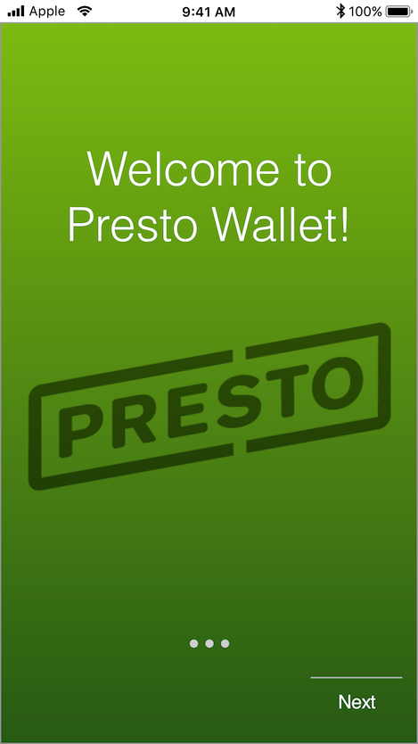
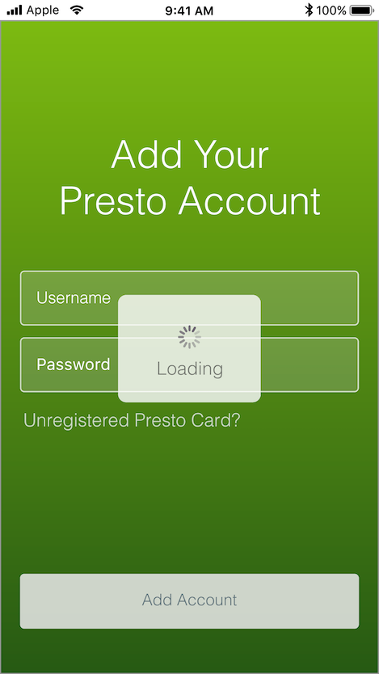
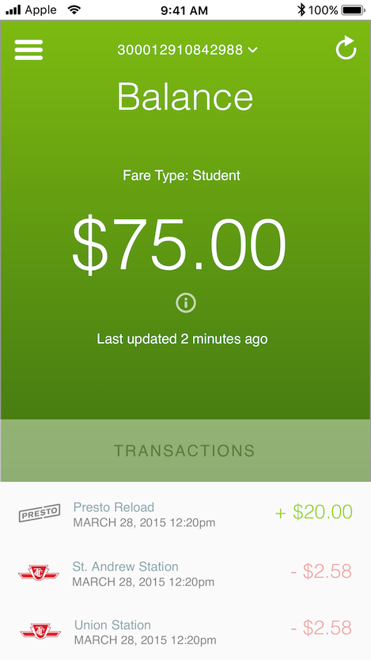
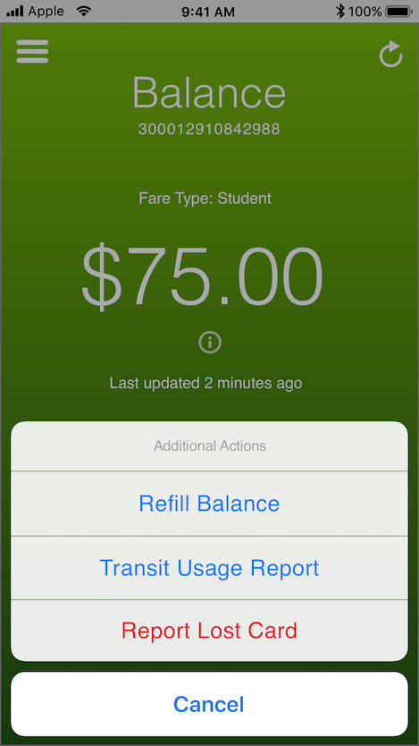
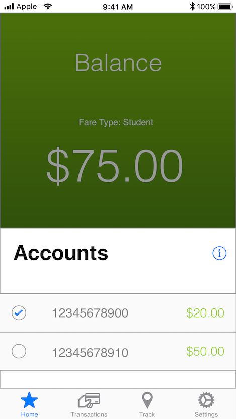
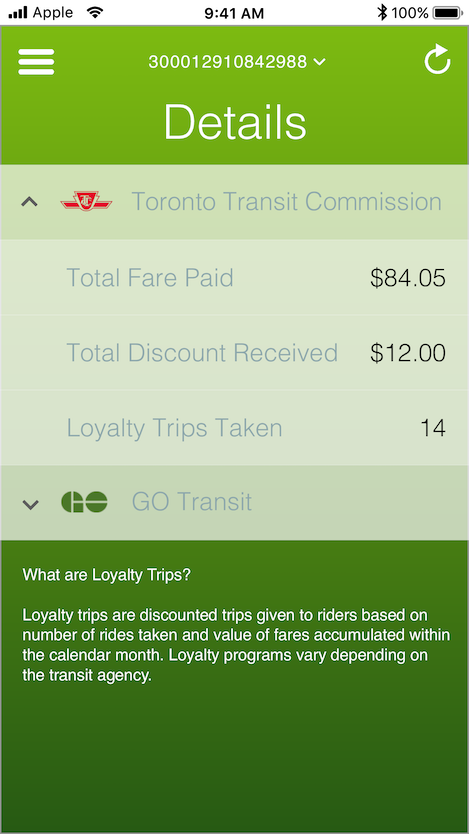
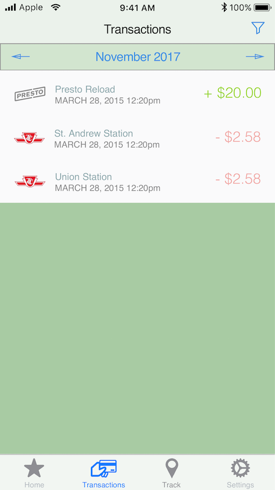
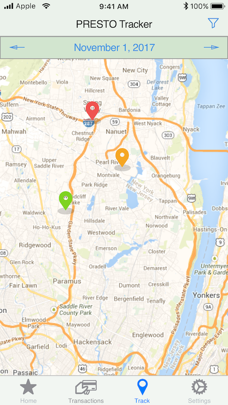
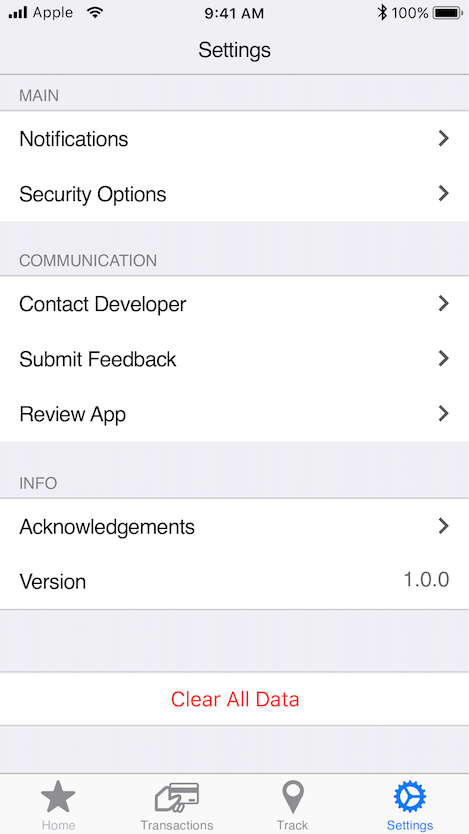

# PRESTO Wallet
An iOS application for PRESTO cardholders to see their balance, transactions, and other information about their PRESTO card usage.

## What is PRESTO?
The PRESTO card is a contactless card used for fare payments used on public transit systems in Ontario, Canada.

## Mockups
These are some mockups I designed in [Sketch](https://www.sketchapp.com/). These are only meant as guidelines, and are **not** meant to be the exact representation of the product.

|   |  |  |
|:---:|:---:|:---:|
| Landing | Login | Card Balance |

|   |  |  |
|:---:|:---:|:---:|
| Actionsheet | Switch Accounts | Details |

|   |  |  |
|:---:|:---:|:---:|
| Transactions | Trip Tracker | Settings |

## License
This project is licensed under the Apache License (v2). Please see the [LICENSE](LICENSE) for more details.
